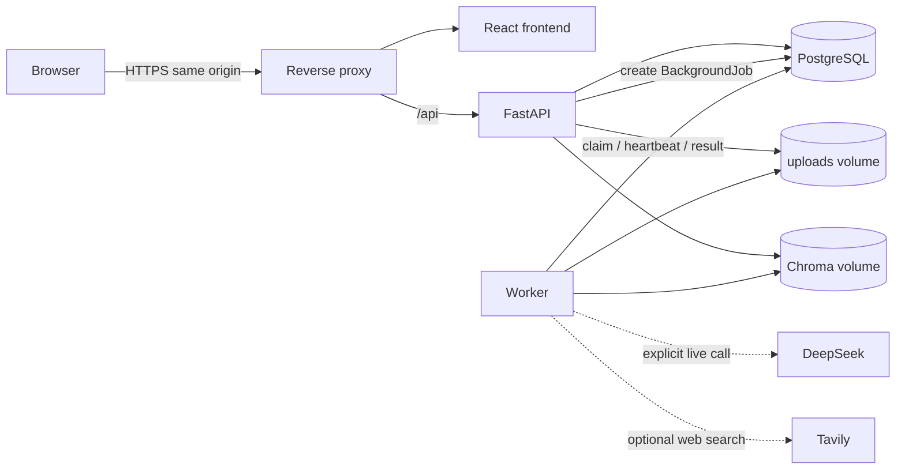
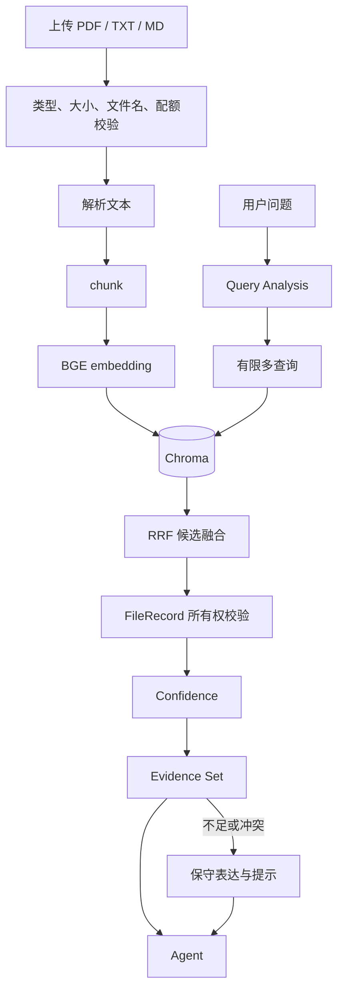
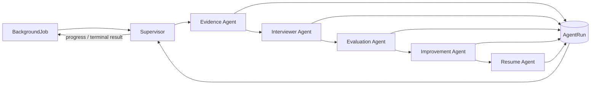
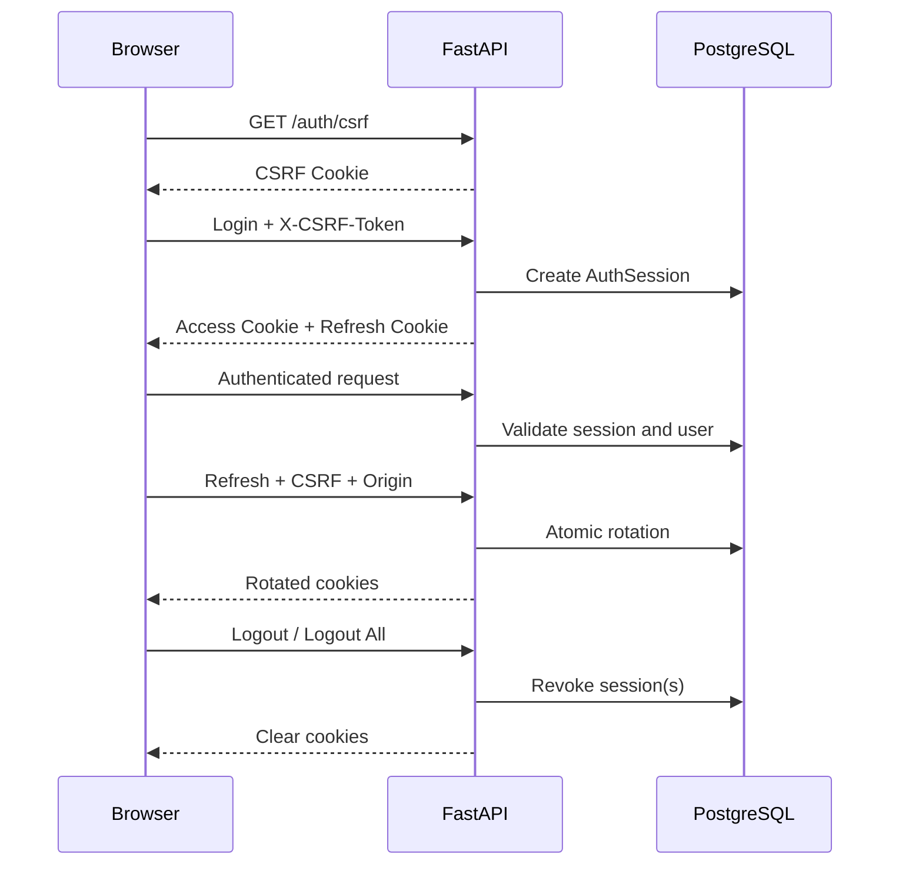
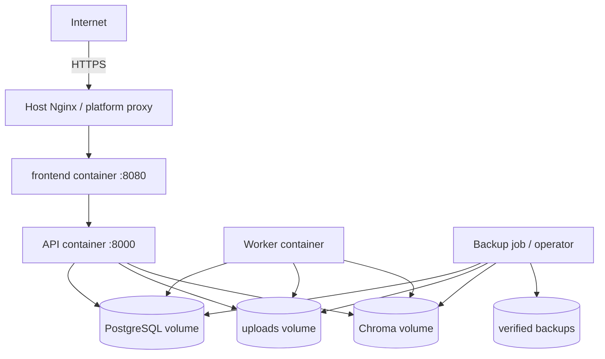

# 最终架构图

以下 Mermaid 源码可直接在 GitHub Markdown 渲染。外部 DeepSeek/Tavily 只有在显式配置和业务需要时访问；默认测试不联网。

## 1. 系统架构

## 2. RAG 流程

## 3. Agent 流程

每个 Agent 只获得当前阶段必要的结构化上下文。`AgentRun` 保存可审计元数据，不在普通用户 UI 展示内部 Prompt、节点、payload 或执行 trace。

## 4. 认证流程

## 5. 部署图

PostgreSQL 和 Worker 不暴露公网端口。API 也不直接对公网服务；外部代理只连接 loopback 上的 frontend 容器映射。
